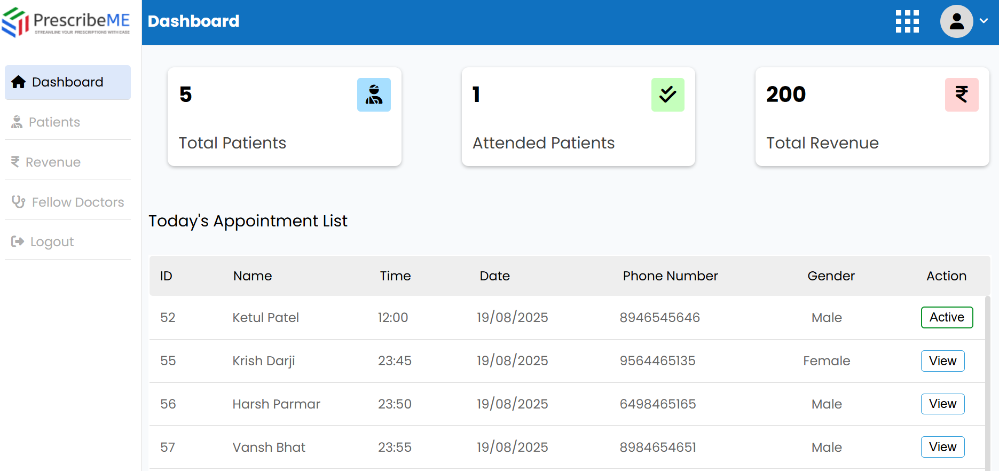

# PrescribeME

The PrescribeME is a comprehensive web solution with three main modules. 
1) The Doctor Module enables doctors to manage appointments, prescriptions, and consultations. 
2) The Receptionist Module facilitates patient registration, appointment scheduling, and administrative tasks. 
3) The Pharmacist Module streamlines prescription fulfillment, medication dispensing, and payment management.

The system provides an online platform for hospital staff, patients, and doctors to manage and access medical information and services from any location, at any time. This enhances hospital efficiency by digitizing and automating various processes, fostering collaboration among different departments, and improving the quality of patient care. 

Overall, the use of a PrescribeME can improve the quality of care, reduce operational costs, and enhance the overall patient experience by ensuring timely and accurate delivery of medical services. 

**IMPORTANT**

To ensure the database is properly configured before executing the code, please import the contents of the "main.sql" file into your database.

## Screenshots

### Doctor's Dashboard

